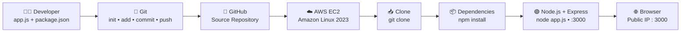

# 🚀 Node.js + Express \| AWS EC2 Dynamic Website

```{=html}
<p align="center">
```
``{=html}
``{=html}
``{=html}
``{=html}
``{=html}
```{=html}
</p>
```
```{=html}
<p align="center">
```
`<b>`{=html}GitHub-based deployment of a Node.js + Express application
on AWS EC2`</b>`{=html}
```{=html}
</p>
```

------------------------------------------------------------------------

## 🌟 Project at a Glance

  Area                  Details
  --------------------- -------------------
  🧩 Application        Node.js + Express
  ☁️ Cloud              AWS EC2
  🖥️ Server OS          Amazon Linux 2023
  ⚙️ Instance           t3.micro
  📦 Package Manager    npm
  🔀 Version Control    Git
  🌐 Repository         GitHub
  🔌 Application Port   `3000`
  🚀 Entry Point        `app.js`

> **Project objective:** create the application locally, push the source
> code to GitHub, provision an EC2 server, clone the repository, install
> dependencies with `npm install`, run the Express application and
> verify it from a browser through port `3000`.

------------------------------------------------------------------------

# 🏗️ Deployment Architecture



### 🔄 Deployment Chain

**Developer → Git → GitHub → EC2 → Clone → npm install → Node.js/Express
→ Browser**

The project report also documents this same workflow visually, including
the EC2 environment, dependency installation and final browser
verification.

------------------------------------------------------------------------

# 🎯 What This Project Demonstrates

-   Creating a basic **Node.js + Express** application
-   Managing source code with **Git**
-   Publishing the project to **GitHub**
-   Launching an **Amazon Linux 2023 EC2** instance
-   Using **EC2 User Data** for initial package installation
-   Connecting to EC2 through **SSH**
-   Verifying `node`, `npm` and `git`
-   Cloning an application repository onto the server
-   Understanding why the application initially fails before
    dependencies are installed
-   Using `npm install` to install Express and its dependency tree
-   Understanding a Linux **ownership / permission** issue caused by
    `sudo git clone`
-   Correcting ownership with `chown`
-   Allowing TCP **port 3000** through the Security Group
-   Verifying the deployed Express application from a browser

------------------------------------------------------------------------

# 🧰 Technology Stack

  Technology                 Purpose
  -------------------------- ----------------------------------------------------
  🟢 **Node.js**             JavaScript runtime used to execute the application
  ⚡ **Express.js**          Web framework used by the application
  📦 **npm**                 Installs and manages application dependencies
  🔀 **Git**                 Local source-code version control
  🐙 **GitHub**              Remote Git repository
  ☁️ **AWS EC2**             Cloud compute environment
  🐧 **Amazon Linux 2023**   Operating system running on EC2
  🔐 **Security Group**      Controls inbound network traffic
  🔑 **SSH**                 Secure connection to the EC2 server

------------------------------------------------------------------------

# 📁 Application Structure

### Before `npm install`

``` text
NodeJS-Express-Dynamic-Website/
├── app.js
└── package.json
```

### After `npm install`

``` text
NodeJS-Express-Dynamic-Website/
├── app.js
├── package.json
├── package-lock.json
└── node_modules/
```

### 💡 Why the structure changes

`package.json` declares the application dependency. When `npm install`
runs inside the project directory, npm resolves and installs the
dependency tree, creates `node_modules/`, and records resolved package
information in `package-lock.json`.

------------------------------------------------------------------------

# 💻 Application Source

## `app.js`

``` javascript
const express = require('express');
const app = express();
const port = 3000;

app.get('/', (req, res) => {
  res.send('Hiii from jenkins, added webhook, we are from 18 May Devops batch');
});

app.listen(port, () => {
  console.log(`App listening at http://localhost:${port}`);
});
```

## `package.json`

The project declares **Express** as a dependency and uses:

``` text
node app.js
```

as the application start command.

------------------------------------------------------------------------

# 🚀 Deployment Walkthrough

## 01 · Application Files & Source Code

The initial application contains `app.js` and `package.json` on the
developer laptop.

```{=html}
<p align="center">
```
``{=html}
```{=html}
</p>
```
**Evidence:** source code and dependency definition before deployment.

------------------------------------------------------------------------

## 02 · Git Repository Initialization

The project was initialized as a local Git repository, staged,
committed, renamed to `main`, connected to the GitHub remote and pushed.

``` bash
git init
git status
git add .
git commit -m "tested ok"
git branch main -M
git remote add origin <repository-url>
git push -u origin main
```

```{=html}
<p align="center">
```
``{=html}
```{=html}
</p>
```
**Result:** the local application became a version-controlled Git
project and was pushed to GitHub.

------------------------------------------------------------------------

## 03 · GitHub Repository

The remote repository contains the application source files:

``` text
app.js
package.json
```

```{=html}
<p align="center">
```
``{=html}
```{=html}
</p>
```

------------------------------------------------------------------------

## 04 · EC2 Instance & User Data

An **Amazon Linux 2023** EC2 instance using **t3.micro** was launched.

### User Data

``` bash
#!/bin/bash
yum update -y
yum install nodejs git -y
```

This bootstraps the server with the runtime and Git required for the
deployment workflow.

```{=html}
<p align="center">
```
``{=html}
```{=html}
</p>
```

------------------------------------------------------------------------

## 05 · EC2 Server Status

The EC2 instance is running and the AWS status checks have passed.

```{=html}
<p align="center">
```
``{=html}
```{=html}
</p>
```

------------------------------------------------------------------------

## 06 · Server Environment Verification

After SSH login, the installed tools were verified:

``` bash
node --version
npm --version
git --version
```

The captured environment shows:

``` text
Node.js  v18.20.8
npm      10.8.2
Git      2.50.1
```

```{=html}
<p align="center">
```
``{=html}
```{=html}
</p>
```

------------------------------------------------------------------------

## 07 · Repository Cloning on EC2

The GitHub repository was cloned onto the EC2 server and the project
directory was inspected.

``` bash
git clone <repository-url>
cd NodeJS-Express-Dynamic-Website/
ls
```

The initial project files are:

``` text
app.js
package.json
```

```{=html}
<p align="center">
```
``{=html}
```{=html}
</p>
```
> ⚠️ **Permission learning point:** the captured deployment used
> `sudo git clone`. This made the cloned files root-owned and led to the
> `EACCES` error shown in the next stage.

------------------------------------------------------------------------

## 08 · Dependency Error Before Installation

The application was started before its dependencies were installed:

``` bash
node app.js
```

The result was:

``` text
Error: Cannot find module 'express'
```

### Why?

The repository contained the application source and `package.json`, but
the dependency tree had not yet been installed on the EC2 server.

```{=html}
<p align="center">
```
``{=html}
```{=html}
</p>
```

------------------------------------------------------------------------

## 09 · Permission Fix + `npm install` + Application Start

The cloned project was root-owned because of the earlier
`sudo git clone`.

The ownership was corrected:

``` bash
sudo chown -R ec2-user:ec2-user .
```

Then dependencies were installed from the project directory:

``` bash
npm install
```

The captured result shows:

``` text
added 68 packages, and audited 69 packages
found 0 vulnerabilities
```

Finally:

``` bash
node app.js
```

The application started successfully:

``` text
App listening at http://localhost:3000
```

```{=html}
<p align="center">
```
``{=html}
```{=html}
</p>
```
### 🧠 Key Concept

``` text
GitHub
  ↓
Source files
  ↓
npm install
  ↓
node_modules + package-lock.json
  ↓
node app.js
```

------------------------------------------------------------------------

## 10 · Security Group Configuration

TCP **port 3000** was allowed in the EC2 Security Group so external
browser traffic could reach the Node.js application.

```{=html}
<p align="center">
```
``{=html}
```{=html}
</p>
```
### Network path

``` text
Browser
   │
   │ TCP :3000
   ▼
EC2 Security Group
   │
   ▼
Node.js + Express
```

> 🔐 **Security note:** for real production deployments, inbound access
> should be restricted to the required sources and ports instead of
> broadly opening application ports.

------------------------------------------------------------------------

## 11 · Final Deployment Verification

The application was accessed using the EC2 public IP and port `3000`:

``` text
http://<EC2-PUBLIC-IP>:3000
```

The browser successfully displayed the Express response.

```{=html}
<p align="center">
```
``{=html}
```{=html}
</p>
```
# ✅ Deployment Complete

``` text
Developer
   ↓
Git
   ↓
GitHub
   ↓
AWS EC2
   ↓
git clone
   ↓
npm install
   ↓
node app.js
   ↓
TCP :3000
   ↓
Browser
   ↓
🟢 Node.js + Express Application
```

------------------------------------------------------------------------

# 🧠 Important DevOps Learning

### 1. GitHub does not automatically install dependencies

GitHub stores the project source code. The EC2 server still needs to
install the dependencies declared by the project.

### 2. `npm install` belongs inside the project directory

Run it where `package.json` exists:

``` bash
cd NodeJS-Express-Dynamic-Website
npm install
```

### 3. `sudo git clone` can create ownership problems

When the repository is cloned as root, files can become owned by `root`.

That can prevent the normal `ec2-user` from creating `node_modules`.

``` bash
sudo chown -R ec2-user:ec2-user .
```

### 4. `node app.js` starts the application

The application listens on:

``` text
localhost:3000
```

The EC2 Security Group must also allow the required inbound traffic
before the application can be reached externally.

------------------------------------------------------------------------

# 🛠️ Troubleshooting

```{=html}
<details>
```
```{=html}
<summary>
```
`<b>`{=html}❌ Error: Cannot find module 'express'`</b>`{=html}
```{=html}
</summary>
```
### Cause

Express is declared as a dependency, but the dependencies have not been
installed on the server.

### Fix

``` bash
npm install
```

Then:

``` bash
node app.js
```

```{=html}
</details>
```
```{=html}
<details>
```
```{=html}
<summary>
```
`<b>`{=html}❌ Error: EACCES: permission denied`</b>`{=html}
```{=html}
</summary>
```
### Cause

The repository was cloned using `sudo`, making the project root-owned.

### Fix used in this project

``` bash
sudo chown -R ec2-user:ec2-user .
```

Then:

``` bash
npm install
```

### Better practice

If the working directory is already owned by `ec2-user`, prefer:

``` bash
git clone <repository-url>
```

rather than:

``` bash
sudo git clone <repository-url>
```

```{=html}
</details>
```
```{=html}
<details>
```
```{=html}
<summary>
```
`<b>`{=html}❌ Browser cannot open port 3000`</b>`{=html}
```{=html}
</summary>
```
Check the following:

``` text
1. Node.js application is running
2. Application is listening on port 3000
3. EC2 Security Group allows TCP 3000
4. Correct EC2 public IP is being used
5. URL contains :3000
```

Example:

``` text
http://<EC2-PUBLIC-IP>:3000
```

```{=html}
</details>
```

------------------------------------------------------------------------

# 📸 Project Evidence

The project contains **11 numbered screenshots** documenting the
complete deployment lifecycle.

    \# Evidence
  ---- ------------------------------------------
    01 Application Files and Source Code
    02 Git Repository Initialization and Push
    03 GitHub Repository
    04 EC2 Instance Configuration and User Data
    05 EC2 Server Status
    06 Server Environment Verification
    07 Application Repository Cloning
    08 Application Dependency Error
    09 Node.js Dependency Installation
    10 Security Group Configuration
    11 Deployed Node.js Application

------------------------------------------------------------------------

# 📂 Repository Layout

``` text
NodeJS Express Dynamic Website Project/
│
├── README.md
├── NodeJS Express Dynamic Website.pdf
├── architecture-diagram.png
│
└── screenshots/
    ├── 01-Application-Files-and-Source-Code.png
    ├── 02-Git-Repository-Initialization-and-Push.png
    ├── 03-GitHub-Repository.png
    ├── 04-EC2-Instance-Configuration-and-User-Data.png
    ├── 05-EC2-Server-Status.png
    ├── 06-Server-Environment-Verification.png
    ├── 07-Application-Repository-Cloning.png
    ├── 08-Application-Dependency-Error.png
    ├── 09-Node.js-Dependency-Installation.png
    ├── 10-Security-Group-Configuration.png
    └── 11-Deployed-Node.js-Application.png
```

------------------------------------------------------------------------

# 📚 Documentation Package

  --------------------------------------------------------------------------
  File                                   Purpose
  -------------------------------------- -----------------------------------
  📘 `README.md`                         Complete technical project
                                         documentation

  📕                                     Step-by-step visual project report
  `NodeJS Express Dynamic Website.pdf`   

  🏗️ `architecture-diagram.png`          Deployment workflow architecture

  🖼️ `screenshots/`                      Deployment evidence and
                                         verification screenshots
  --------------------------------------------------------------------------

------------------------------------------------------------------------

# 🏁 Final Outcome

> **The Node.js + Express application was successfully deployed on AWS
> EC2, with the source code maintained in GitHub, dependencies installed
> on the server through npm, port 3000 exposed through the Security
> Group, and the final application verified through the EC2 public IP.**

```{=html}
<p align="center">
```
`<b>`{=html}🚀 GitHub → AWS EC2 → Node.js + Express →
Browser`</b>`{=html}
```{=html}
</p>
```

------------------------------------------------------------------------

```{=html}
<p align="center">
```
`<sub>`{=html}Node.js + Express Dynamic Website • AWS EC2 Deployment
Project`</sub>`{=html}
```{=html}
</p>
```
