# 🚀 Node.js + Express | AWS EC2 Dynamic Website

<p align="center">
  <b>GitHub-based deployment of a Node.js + Express application on AWS EC2</b>
</p>

<p align="center">
  
  
  
  
  
</p>

---

## 📌 Project Overview

This project demonstrates a practical **GitHub → AWS EC2 → Node.js + Express deployment workflow**.

The application source code is maintained in GitHub. The EC2 server is prepared with Node.js and Git, the repository is cloned onto the server, project dependencies are installed using `npm install`, and the Express application is started with Node.js.

The application is then accessed through the EC2 public IP on **port 3000**.

---

## 🏗️ Architecture

<p align="center">
  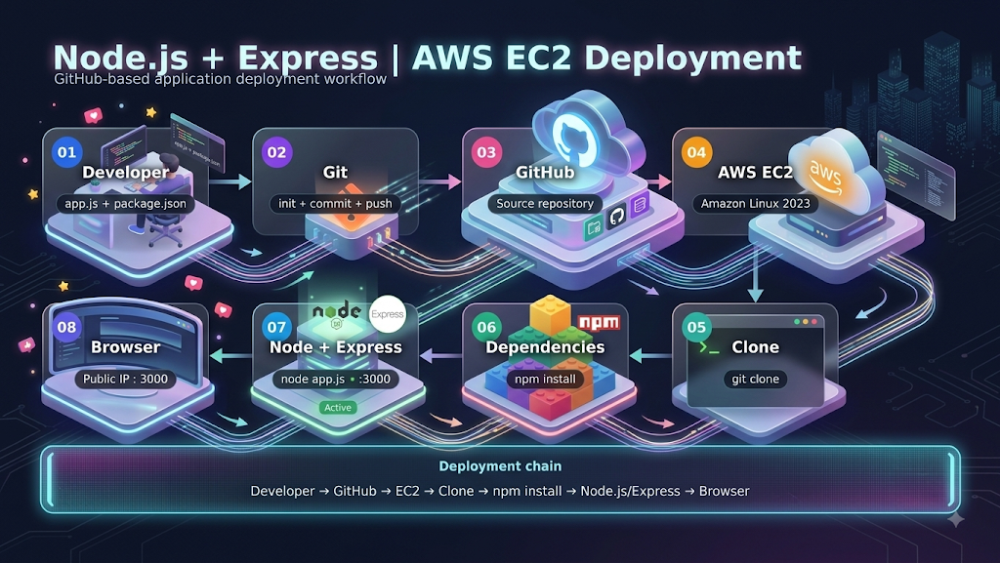
</p>

### Deployment Flow

**Developer → Git → GitHub → AWS EC2 → Git Clone → npm install → Node.js + Express → Browser**

---

## 🧰 Technologies Used

| Technology | Purpose |
|---|---|
| **Node.js** | JavaScript runtime used to run the application |
| **Express.js** | Web framework used to create the HTTP server |
| **npm** | Installs project dependencies defined in `package.json` |
| **Git** | Version control and source-code management |
| **GitHub** | Remote source-code repository |
| **AWS EC2** | Cloud server used to host the application |
| **Amazon Linux 2023** | Operating system for the EC2 instance |
| **SSH** | Secure remote access to the EC2 server |

---

## 📂 Project Files

```text
NodeJS-Express-Dynamic-Website/
│
├── app.js
├── package.json
├── README.md
├── architecture-diagram.jpg
├── NodeJS_Express.pdf
└── screenshots/
    ├── 01-Application-Files-and-Source-Code.jpg
    ├── 02-Git-Repository-Initialization-and-Push.png
    ├── 03-GitHub-Repository.png
    ├── 04-EC2-Instance-Configuration-and-User-Data.png
    ├── 05-EC2-Server-Status.png
    ├── 06-Server-Environment-Verification.png
    ├── 07-Application-Repository-Cloning.png
    ├── 08-Application-Dependency-Error.png
    ├── 09-Node.js-Dependency-Installation.png
    ├── 10-Security-Group-Configuration.png
    └── 11-Deployed-Node.js-Application.png
```

---

## 💻 Application Code

### `app.js`

```javascript
const express = require('express');
const app = express();
const port = 3000;

app.get('/', (req, res) => {
  res.send('Hiii from jenkins, added webhook, we are from 18 May Devops batch');
});

app.listen(port, () => {
  console.log(`App listening at http://localhost:${port}`);
});
```

### `package.json`

The project uses Express as its application dependency.

```json
{
  "name": "jenkins-node-app",
  "version": "1.0.0",
  "main": "app.js",
  "scripts": {
    "start": "node app.js"
  },
  "dependencies": {
    "express": "^4.18.2"
  }
}
```

---

# ☁️ Deployment Process

## 1️⃣ Create the Application

The Node.js application contains two primary files:

- `app.js`
- `package.json`

The application code and project path were captured before uploading the project to GitHub.

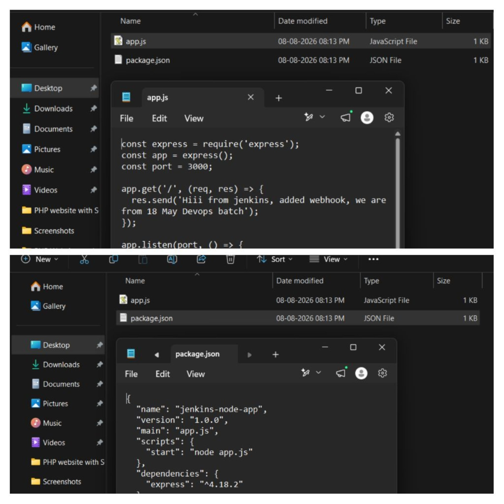

---

## 2️⃣ Initialize Git Repository and Push Code

Git was initialized locally and the application files were added, committed, and pushed to the GitHub repository.

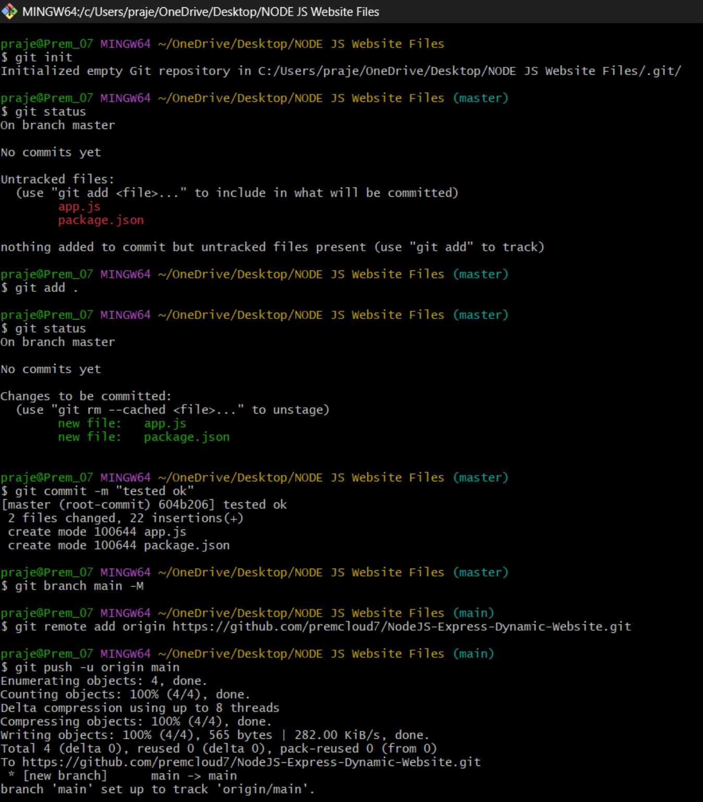

---

## 3️⃣ GitHub Source Repository

The completed Node.js project is stored in the GitHub repository.

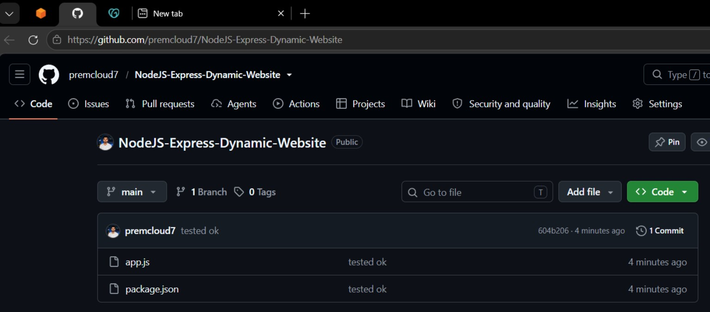

---

## 4️⃣ Launch AWS EC2 Instance

An EC2 instance was launched using **Amazon Linux 2023** with the required instance configuration.

User Data was used during launch to update the system and install Node.js and Git.

```bash
#!/bin/bash
yum update -y
yum install nodejs git -y
```

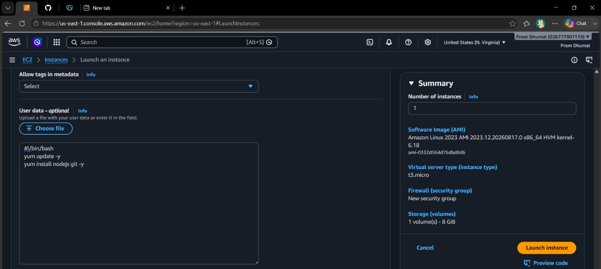

---

## 5️⃣ EC2 Server Running

After launch, the EC2 instance reached the **Running** state and passed its status checks.

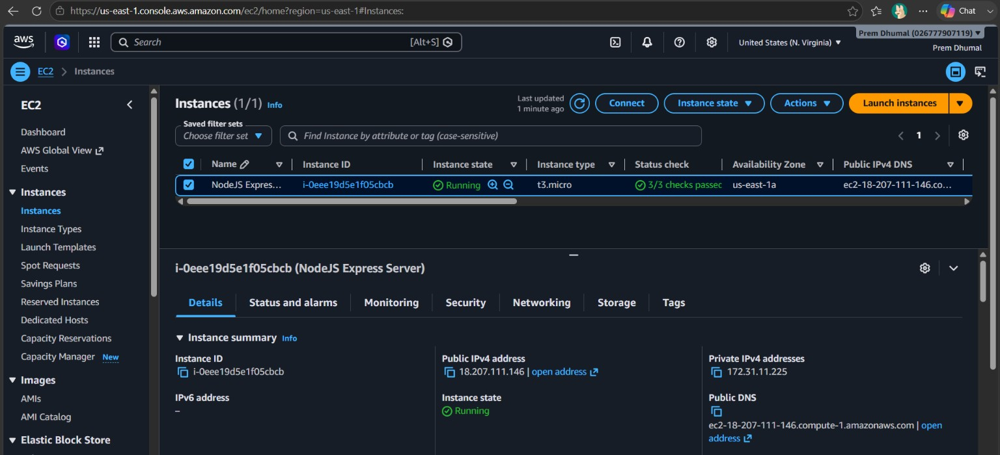

---

## 6️⃣ Verify Server Environment

After connecting to the EC2 instance through SSH, the installed versions of Node.js, npm, and Git were checked.

Example:

```bash
node --version
npm --version
git --version
```

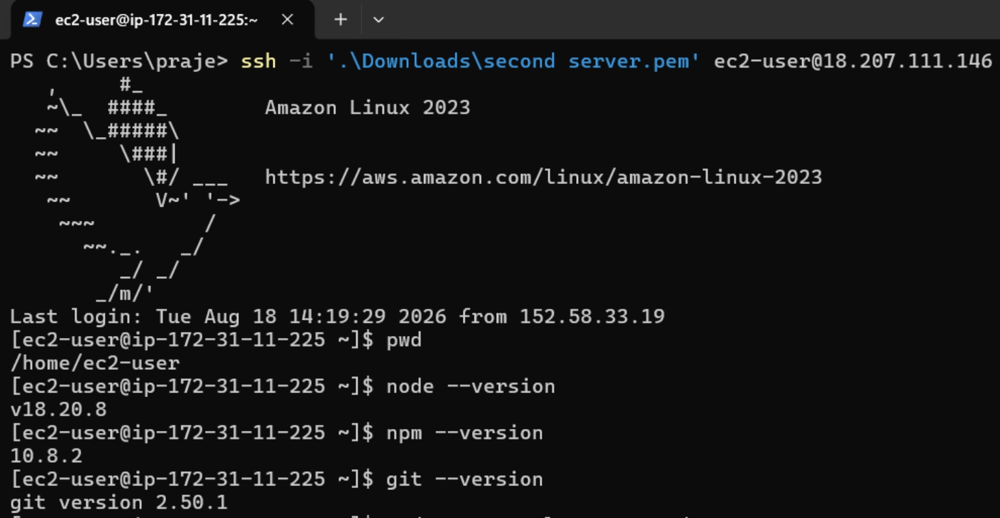

---

## 7️⃣ Clone Application from GitHub

The application was not manually uploaded to the EC2 server.

Instead, the source code was retrieved directly from GitHub using:

```bash
git clone <repository-url>
```

The cloned repository automatically created the project directory containing:

```text
app.js
package.json
```

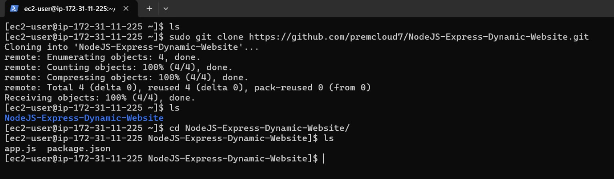

---

## 8️⃣ Initial Application Run

The application was first started before installing its project dependencies:

```bash
node app.js
```

This produced a dependency error because the Express package was not yet available in the project.

```text
Error: Cannot find module 'express'
```

This demonstrates why project dependencies must be installed before running the application.

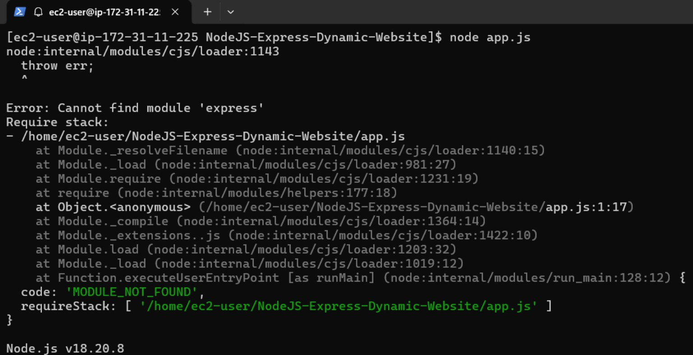

---

## 9️⃣ Install Project Dependencies

The cloned `package.json` was used by npm to determine the required project dependencies.

The command was executed inside the project directory:

```bash
npm install
```

This installed Express and its required dependency packages and created the `node_modules` directory.

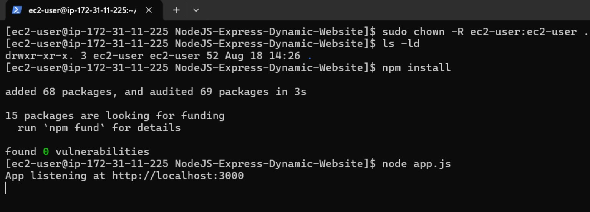

---

## 🔟 Configure EC2 Security Group

Inbound access for **TCP port 3000** was configured in the EC2 security group so that the Express application could be reached from a browser.

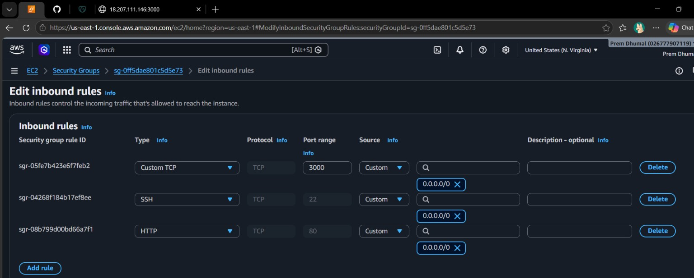

> **Note:** For production workloads, access should be restricted according to the application's security requirements rather than unnecessarily exposing ports to the entire internet.

---

## 1️⃣1️⃣ Start and Verify the Application

After installing dependencies, the application was started with:

```bash
node app.js
```

The server reported:

```text
App listening at http://localhost:3000
```

The application was then accessed using:

```text
http://<EC2-Public-IP>:3000
```

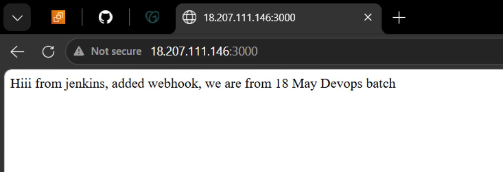

---

# 🔄 Complete Deployment Workflow

```text
┌──────────────┐
│   Developer  │
│ app.js       │
│ package.json │
└──────┬───────┘
       │
       │ git init → add → commit → push
       ▼
┌──────────────┐
│    GitHub    │
│ Source Code  │
└──────┬───────┘
       │
       │ git clone
       ▼
┌────────────────────┐
│      AWS EC2       │
│  Amazon Linux 2023 │
│                    │
│ Node.js + Git      │
└─────────┬──────────┘
          │
          │ npm install
          ▼
┌────────────────────┐
│   Dependencies     │
│    node_modules    │
│      Express       │
└─────────┬──────────┘
          │
          │ node app.js
          ▼
┌────────────────────┐
│  Node.js + Express │
│      Port 3000     │
└─────────┬──────────┘
          │
          │ Public IP:3000
          ▼
┌────────────────────┐
│      Browser       │
│   Application Live │
└────────────────────┘
```

---

# 🧠 Key Learning Points

### 🔹 Source Code Management
The developer maintains the application source code in GitHub instead of manually transferring application files to the server.

### 🔹 EC2 Application Deployment
The EC2 instance acts as the cloud server where the Node.js application is executed.

### 🔹 Dependency Management
`package.json` defines the required application dependency, while:

```bash
npm install
```

reads that file and installs the required packages.

### 🔹 Application Location
A Node.js application does **not** have to be placed specifically under `/var/www`.

It can run from another directory as long as the required application files and dependencies are available on the server.

### 🔹 Port Access
Express listens on port **3000**, therefore the EC2 security group must allow appropriate inbound traffic to that port for external browser access.

---

# 📸 Deployment Evidence

All implementation screenshots are organized inside the [`screenshots`](screenshots/) directory.

The screenshots document the deployment from source-code creation through the final running application.

---

# 📄 Project Documentation

📘 **Detailed Project PDF:** [`NodeJS_Express.pdf`](NodeJS_Express.pdf)

🏗️ **Architecture Diagram:** [`architecture-diagram.jpg`](architecture-diagram.jpg)

---

# 🎯 Project Outcome

Successfully deployed a **Node.js + Express dynamic web application on AWS EC2** using a GitHub-based source-code workflow.

The project demonstrates the practical flow:

> **Develop → Git → GitHub → EC2 → Clone → Install Dependencies → Run → Access from Browser**

---

## 👨‍💻 Project Summary

**Project:** Node.js + Express | AWS EC2 Dynamic Website  
**Deployment:** AWS EC2  
**Source Control:** Git + GitHub  
**Runtime:** Node.js  
**Framework:** Express.js  
**Operating System:** Amazon Linux 2023  
**Application Port:** 3000

---

<p align="center">
  <b>🚀 Built as a practical Cloud & DevOps deployment project</b>
</p>
